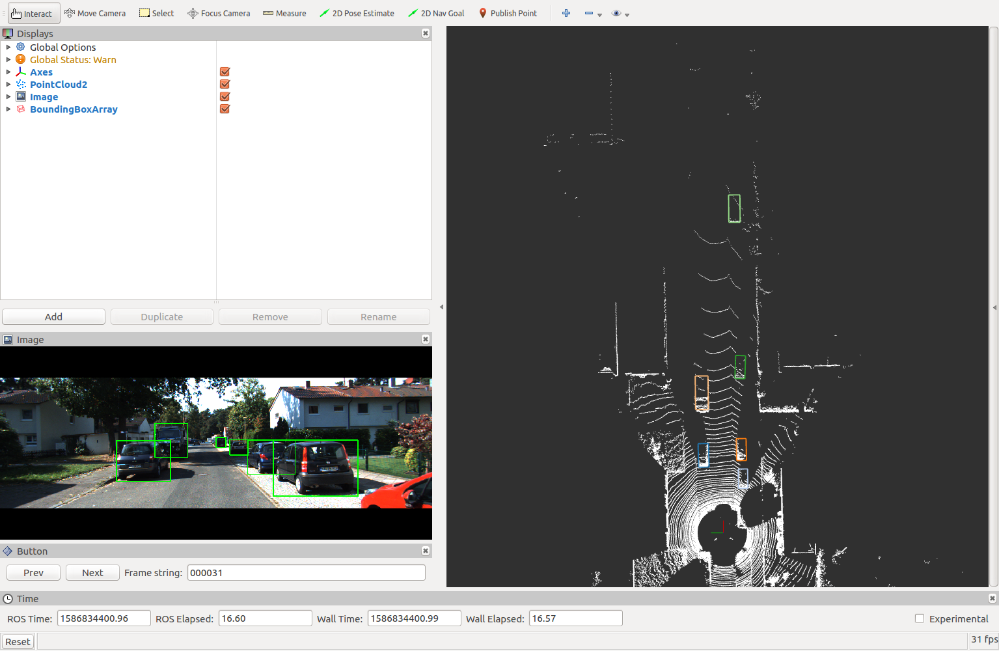

# Visualize KITTI Data Based on ROS and Rviz



This package is used to visualize kitti data using ROS and Rviz. So far, there has the following main features
- [x] [Visualize object data](#Visualize-Object-Data)
- [x] [Visualize track data](#Visualize-Track-Data)
- [ ] Visualize road data
- [ ] Visualize raw data

## Dependencies
- [ROS](https://www.ros.org/)

&ensp;&ensp;&ensp;&ensp;All procedures are based on ROS, which is commonly use in robotics and self-driving cars. We tested this package on the `Kinetic` version, but we believe that it can be used on other versions as well.

- [jsk_recognition_msgs](https://jsk-docs.readthedocs.io/projects/jsk_recognition/en/latest/jsk_recognition_msgs/index.html)

&ensp;&ensp;&ensp;&ensp;This is required for visualizing 3D bounding boxes of objects.

## Usage

### Installation

#### 1. ROS
[Ubuntu install of ROS Kinetic](http://wiki.ros.org/kinetic/Installation/Ubuntu)

#### 2. jsk_recognition_msgs
```bash
sudo apt-get install ros-kinetic-jsk-recognition-msgs
sudo apt-get install ros-kinetic-jsk-rviz-plugins
```
#### 3. kitti_visualizer package
```bash
cd ros_workspace/src
git clone git@github.com:xiaoliangabc/kitti_visualizer.git
cd ros_workspace
catkin_make
source devel/setup.bash
```

### Visualize Object Data

#### Download Object Data
Download object data (velodyne, image_2, calib, label_2) from [KITTI Object Detection Dataset](http://www.cvlibs.net/datasets/kitti/eval_object.php?obj_benchmark=3d) and set the folder structure as following:
```
object
    testing
        calib
        image_2
        results
        velodyne
    training
        calib
        image_2
        label_2
        velodyne
```

#### Modify Config File
Open [launch/object_visualizer.launch](launch/object_visualizer.launch) file, change the following configs:
- `data_path`: folder that contains object data
- `dataset`: which dataset want to visualize (`training` / `testing`)
- `frame_size`: number of frames for the corresponding dataset (`training: 7481` / `tesing: 7518`)
- `current_frame`: frame index want to start visualization

#### Launch object_visualizer
Run
```
roslaunch kitti_visualizer object_visualizer.launch
```
Then `Rviz` will be launched, the layout of `Rviz` is look like


#### Switch Frames
Move the mouse to the bottom left of the screen:
- Click the **Prev**  button: switch to the previous frame
- Click the **Next**  button: switch to the next frame
- Type frame number to **Frame string** box: jump to the frame you specified


### Visualize Track Data

#### Download Track Data
Download track data (velodyne, image_2, calib, label_2) from [KITTI Object Tracking Dataset](http://www.cvlibs.net/datasets/kitti/eval_tracking.php) and set the folder structure as following:
```
tracking
    testing
        calib
        image_02
        results
        velodyne
        oxts
    training
        calib
        image_02
        label_02
        velodyne
        oxts
```

#### Modify Config File
Open [launch/track_visualizer.launch](launch/track_visualizer.launch) file, change the following configs:
- `data_path`: folder that contains track data
- `dataset`: which dataset want to visualize (`training` / `testing`)
- `scene`: which scene want to visualize (`00xx`)
- `current_frame`: frame index want to start visualization

#### Launch track_visualizer
Run
```
roslaunch kitti_visualizer track_visualizer.launch
```
Then `Rviz` will be launched, the layout of `Rviz` is look like


## Reference
[kitti_object_vis](https://github.com/kuixu/kitti_object_vis)

[second-ros](https://github.com/lgsvl/second-ros)
